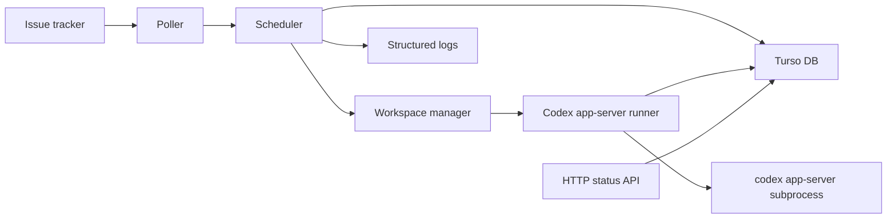

# Alophony Specification

Status: Draft
Last updated: 2026-05-20

## 1. Overview

Alophony is a TypeScript-based orchestration service that continuously watches work items, dispatches eligible tasks to Codex through `codex app-server`, persists orchestration state in Turso, and exposes operator-visible runtime status.

The system is designed as a long-running daemon rather than a one-shot CLI. It must survive process restarts, avoid duplicate agent runs, retain run history, and make failures inspectable without requiring an attached debugger.

## 2. Technology Choices

### 2.1 Runtime

- Language: TypeScript.
- Runtime: Node.js 22 LTS or newer.
- Module format: ESM.
- Package manager: pnpm.
- Validation: Zod.
- Logging: Pino structured logs.
- Tests: Vitest.

### 2.2 Database

- Primary database: Turso.
- SQL dialect: SQLite-compatible SQL.
- TypeScript client for v1: `@libsql/client`.
  - Rationale: v1 prioritizes stable Turso Cloud access, mature ecosystem behavior, and predictable migrations over adopting the newest Turso TypeScript package immediately.
  - Constraint: all database access must stay behind an internal repository layer so the client can later move to newer Turso TypeScript packages without changing orchestration logic.
- Schema migrations: SQL migration files executed by an explicit migration command.
- Database is the source of truth for orchestration state, locks, attempts, run history, and operator-visible snapshots.

### 2.3 Agent Integration

- Agent runner: `codex app-server`.
- Transport: subprocess stdio.
- Protocol: the targeted Codex app-server JSON-RPC/JSONL protocol.
- Protocol types must be generated from the installed Codex app-server when available, using the command exposed by that Codex version.
- The app-server process is launched per run attempt in the issue workspace.

### 2.4 Optional HTTP Surface

- HTTP server: Fastify.
- The HTTP surface is for observability and limited control only. It must not become required for core orchestration.

## 3. Goals

- Poll a tracker for candidate work items.
- Persist all orchestration state in Turso.
- Dispatch eligible work items to Codex app-server.
- Enforce concurrency limits and per-issue exclusivity.
- Recover from process restarts using Turso state plus tracker state.
- Keep a complete attempt history for debugging.
- Support configurable prompts, workspace paths, retry policy, and Codex settings.
- Provide structured logs and a runtime status API.

## 4. Non-Goals

- Building a rich dashboard in the first implementation.
- Implementing a custom coding agent protocol.
- Replacing the tracker as the product source of truth.
- Supporting multiple tracker providers in the first version.
- Distributed multi-region scheduling in the first version.

## 5. System Architecture



Main services:

- `ConfigService`: loads and validates runtime configuration.
- `TrackerClient`: reads candidate issues and current issue state.
- `Scheduler`: selects eligible work, acquires locks, and starts attempts.
- `RunCoordinator`: owns active in-process attempts.
- `WorkspaceManager`: creates, validates, and cleans workspaces.
- `CodexAppServerClient`: launches Codex, starts sessions, streams events, and maps failures.
- `RunRepository`: reads and writes Turso state.
- `StatusApi`: exposes read-only operational status.

## 6. Configuration

Configuration is loaded in this order:

1. Built-in defaults.
2. `alophony.config.ts` or `alophony.config.json`.
3. Environment variables.
4. CLI flags.

The final effective configuration must be validated before the daemon starts.

Required fields:

- `tracker.kind`: initially `linear`.
- `tracker.projectSlug`.
- `tracker.activeStates`.
- `tracker.terminalStates`.
- `database.url`.
- `database.authToken` or environment variable reference.
- `workspace.root`.
- `codex.command`: default `codex app-server`.
- `scheduler.pollIntervalMs`.
- `scheduler.maxConcurrency`.

Example:

```ts
export default {
  tracker: {
    kind: "linear",
    projectSlug: "ENG",
    activeStates: ["Todo", "In Progress"],
    terminalStates: ["Done", "Canceled", "Cancelled", "Duplicate"],
  },
  database: {
    url: process.env.TURSO_DATABASE_URL,
    authToken: process.env.TURSO_AUTH_TOKEN,
  },
  workspace: {
    root: "./.alophony/workspaces",
  },
  scheduler: {
    pollIntervalMs: 30_000,
    maxConcurrency: 3,
    lockTtlMs: 10 * 60_000,
  },
  codex: {
    command: "codex app-server",
    model: process.env.CODEX_MODEL,
    approvalPolicy: "never",
    sandboxPolicy: "workspace-write",
  },
};
```

Secrets must never be logged.

## 7. Database Model

### 7.1 Tables

#### `issues`

Caches normalized tracker issues.

- `id` text primary key.
- `tracker_kind` text not null.
- `tracker_issue_id` text not null.
- `identifier` text not null.
- `title` text not null.
- `state` text not null.
- `url` text.
- `assignee` text.
- `priority` text.
- `raw_json` text not null.
- `seen_at` text not null.
- `updated_at` text not null.

Unique index:

- `(tracker_kind, tracker_issue_id)`.

#### `runs`

Represents the orchestration lifecycle for one issue.

- `id` text primary key.
- `issue_id` text not null references `issues(id)`.
- `status` text not null.
- `status_reason` text.
- `workspace_path` text not null.
- `current_attempt_id` text references `run_attempts(id)`.
- `claimed_by` text.
- `claim_expires_at` text.
- `started_at` text.
- `finished_at` text.
- `created_at` text not null.
- `updated_at` text not null.

Allowed statuses:

- `queued`
- `claimed`
- `running`
- `succeeded`
- `failed`
- `retry_wait`
- `canceled`
- `terminal_cleanup`

#### `run_attempts`

Stores every Codex attempt.

- `id` text primary key.
- `run_id` text not null references `runs(id)`.
- `attempt_number` integer not null.
- `status` text not null.
- `codex_thread_id` text.
- `codex_turn_id` text.
- `process_pid` integer.
- `exit_code` integer.
- `error_code` text.
- `error_message` text.
- `started_at` text not null.
- `finished_at` text.
- `created_at` text not null.
- `updated_at` text not null.

Allowed statuses:

- `starting`
- `running`
- `needs_input`
- `succeeded`
- `failed`
- `timed_out`
- `killed`

#### `run_events`

Append-only event stream.

- `id` text primary key.
- `run_id` text not null references `runs(id)`.
- `attempt_id` text references `run_attempts(id)`.
- `type` text not null.
- `message` text.
- `payload_json` text not null.
- `created_at` text not null.

#### `scheduler_locks`

Prevents duplicate dispatch across processes.

- `key` text primary key.
- `owner_id` text not null.
- `expires_at` text not null.
- `created_at` text not null.
- `updated_at` text not null.

Lock keys:

- `global:scheduler`
- `issue:<tracker_kind>:<tracker_issue_id>`
- `run:<run_id>`

#### `schema_migrations`

- `version` text primary key.
- `applied_at` text not null.

### 7.2 Locking Rules

Before starting any run, the scheduler must acquire an issue-level lock in Turso.

Lock acquisition must be implemented as an atomic insert/update transaction:

1. Insert lock if it does not exist.
2. If it exists and `expires_at` is in the past, replace owner and expiry.
3. Otherwise, acquisition fails.

The active process must renew locks while an attempt is running. If lock renewal fails, the attempt must stop itself and mark the run as `failed` with reason `lock_lost`.

### 7.3 Time Format

All timestamps are UTC ISO 8601 strings.

## 8. Tracker Integration

Initial tracker: Linear.

The tracker client must expose these normalized operations:

- `listCandidateIssues(config): Promise<Issue[]>`
- `getIssue(issueId): Promise<Issue | null>`
- `listTerminalIssues(config): Promise<Issue[]>`
- `listBlockingIssues(issueId): Promise<Issue[]>`

Candidate issue rules:

- Issue state is in `activeStates`.
- Issue state is not in `terminalStates`.
- Issue is in the configured project.
- If the issue has blockers, all blockers must be terminal before dispatch.
- If an issue already has a non-terminal run, it is not eligible.

Tracker writes are not required in the first version. If added later, they must be isolated behind `TrackerWriter`.

## 9. Scheduler Behavior

The v1 deployment model is a single active scheduler process. Turso locks must still be implemented in v1 because they protect against accidental duplicate processes and provide a path to multi-process scheduling later.

### 9.1 Startup

On daemon startup:

1. Load and validate config.
2. Connect to Turso.
3. Run migrations.
4. Generate or validate Codex protocol types when configured.
5. Mark stale `running` attempts from the previous process as `failed` with reason `process_restarted`.
6. Release expired locks owned by dead processes.
7. Fetch terminal tracker issues and cleanup their workspaces.
8. Start poll loop.
9. Start reconciliation loop.

### 9.2 Poll Loop

Every `scheduler.pollIntervalMs`:

1. Fetch candidate issues from tracker.
2. Upsert normalized issues.
3. Filter ineligible issues.
4. Sort candidates by priority, updated time, then identifier.
5. Dispatch until `maxConcurrency` is reached.

Poll failures must be logged and retried on the next tick. A poll failure must not stop active runs.

### 9.3 Dispatch

To dispatch an issue:

1. Acquire issue lock.
2. Create or reuse a `runs` row.
3. Create workspace.
4. Render prompt.
5. Create `run_attempts` row.
6. Launch Codex app-server.
7. Stream and persist events.
8. Mark attempt and run final status.
9. Release lock.

### 9.4 Reconciliation

Reconciliation runs independently from polling.

For each active run:

- If tracker issue is terminal: stop Codex, mark run `canceled`, cleanup workspace.
- If tracker issue is no longer active: stop Codex, mark run `canceled`, keep workspace for inspection.
- If the process is gone and lock expired: mark attempt `failed`.
- If retry policy allows retry: move run to `retry_wait`.

## 10. Workspace Management

Workspace paths must be deterministic and sanitized:

```text
<workspace.root>/<tracker_kind>/<issue_identifier>-<short_issue_id>
```

Safety requirements:

- Resolved workspace path must stay under `workspace.root`.
- Workspace creation must be idempotent.
- Cleanup must never delete paths outside `workspace.root`.
- Hook scripts must have timeouts.

Optional hooks:

- `workspace.beforeCreate`
- `workspace.afterCreate`
- `workspace.beforeRun`
- `workspace.afterRun`
- `workspace.beforeCleanup`

Hook failures are fatal only when the hook is marked `required`.

## 11. Prompt Construction

Prompt templates are plain text files with variables.

Required template inputs:

- `issue.identifier`
- `issue.title`
- `issue.description`
- `issue.url`
- `issue.state`
- `workspace.path`
- `run.attemptNumber`

Template rendering must fail on unknown variables.

The final prompt must be persisted to `run_events` as metadata, but large raw prompt bodies may be redacted from normal logs.

## 12. Codex App-Server Runner

### 12.1 Launch

The runner starts the configured command in the issue workspace:

```text
codex app-server
```

The runner must keep stdout protocol traffic separate from stderr diagnostics.

### 12.2 Session Lifecycle

For each attempt:

1. Spawn app-server subprocess.
2. Initialize session using the installed Codex app-server protocol.
3. Send the rendered prompt as a turn.
4. Stream events until terminal result, timeout, or external cancellation.
5. Persist Codex thread and turn identities when provided by the protocol.
6. Stop subprocess.

### 12.3 Event Mapping

Codex events must be mapped to normalized run events:

- `session_started`
- `turn_started`
- `assistant_message`
- `tool_call_started`
- `tool_call_finished`
- `approval_requested`
- `user_input_requested`
- `turn_finished`
- `session_failed`

Approval and user-input-required events must not leave a run stalled indefinitely. In the first version:

- Approval policy is configured before the run starts.
- Interactive user input is unsupported.
- If Codex requires input, the attempt fails with `needs_input_unsupported`.

### 12.4 Timeouts

Timeouts:

- `codex.startupTimeoutMs`
- `codex.turnTimeoutMs`
- `codex.idleTimeoutMs`
- `codex.shutdownTimeoutMs`

On timeout, the runner sends graceful termination first, then kills the process if needed.

## 13. Retry Policy

Retry policy is configured globally and may later be overridden per issue.

Fields:

- `maxAttempts`
- `initialBackoffMs`
- `maxBackoffMs`
- `backoffMultiplier`

Retryable failures:

- tracker transient error before dispatch
- Codex app-server transport startup failure
- Codex process crash
- idle timeout
- lock loss caused by process restart

Non-retryable failures:

- invalid configuration
- invalid prompt template
- workspace path safety violation
- terminal tracker state
- unsupported user input request

## 14. Observability

### 14.1 Logs

All logs are structured JSON.

Required fields when available:

- `service`
- `process_id`
- `owner_id`
- `issue_id`
- `issue_identifier`
- `run_id`
- `attempt_id`
- `codex_thread_id`
- `codex_turn_id`
- `event_type`

### 14.2 Status API

Optional Fastify endpoints:

- `GET /healthz`
- `GET /readyz`
- `GET /api/v1/runs`
- `GET /api/v1/runs/:id`
- `GET /api/v1/issues/:id`
- `GET /api/v1/events?runId=...`
- `POST /api/v1/runs/:id/cancel`

Mutation endpoints must require an operator token.

### 14.3 Metrics

Minimum metrics:

- active runs
- queued runs
- succeeded runs
- failed runs
- average run duration
- attempts per run
- Codex startup failures
- tracker poll failures
- DB write failures

## 15. Security

- Turso auth token is loaded from environment or secret manager.
- Tracker API token is loaded from environment or secret manager.
- Tokens must never be logged.
- Workspace paths must be sanitized.
- Hook commands are trusted operator configuration.
- Codex sandbox and approval policy must be explicit in config.

## 16. CLI Commands

Required commands:

- `alophony migrate`: apply database migrations.
- `alophony validate`: validate config, DB connectivity, tracker connectivity, and Codex command availability.
- `alophony start`: start daemon.
- `alophony status`: print a runtime snapshot.
- `alophony run-once <issue-id>`: dispatch one issue for debugging.

## 17. Testing Requirements

Unit tests:

- config loading and validation
- SQL repository behavior
- lock acquisition and expiry
- workspace path sanitization
- prompt rendering
- scheduler candidate selection
- retry classification

Integration tests:

- Turso-compatible local database migration.
- fake tracker candidate dispatch.
- fake Codex app-server subprocess event stream.
- process restart recovery.
- terminal issue cleanup.

End-to-end smoke test:

- Start daemon with fake tracker and fake Codex app-server.
- Dispatch one issue.
- Persist attempt events.
- Mark run succeeded.
- Restart daemon and verify no duplicate dispatch.

## 18. Definition of Done

The first conforming implementation is complete when:

- TypeScript project builds in strict mode.
- Migrations create all required tables and indexes.
- `alophony validate` catches missing config, DB auth failure, tracker auth failure, and missing Codex command.
- Scheduler dispatches eligible issues and respects max concurrency.
- Turso locks prevent duplicate runs.
- Codex app-server runner can process a full fake protocol stream.
- Run state and events survive process restart.
- Terminal tracker states stop or prevent runs.
- Structured logs include run and issue context.
- Core unit and integration tests pass.

## 19. Open Decisions

- Whether tracker writes should update issue state automatically after success/failure.
- Whether prompt templates live in config, file paths, or both.

## 20. References

- OpenAI Codex app-server docs: https://developers.openai.com/codex/app-server
- Symphony specification: https://github.com/openai/symphony/blob/main/SPEC.md
- Turso TypeScript SDK docs: https://docs.turso.tech/sdk/ts
- Turso SDK overview: https://docs.turso.tech/sdk/introduction
